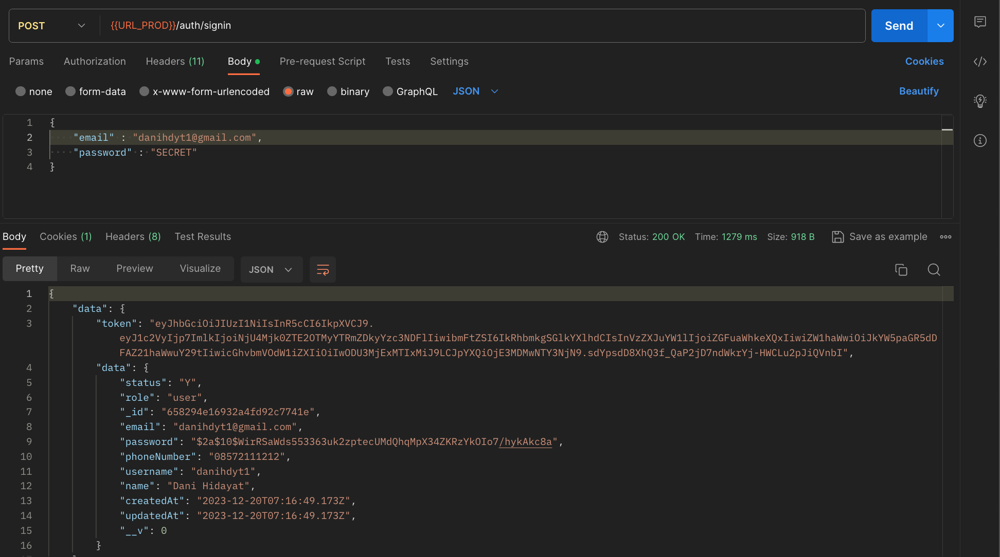
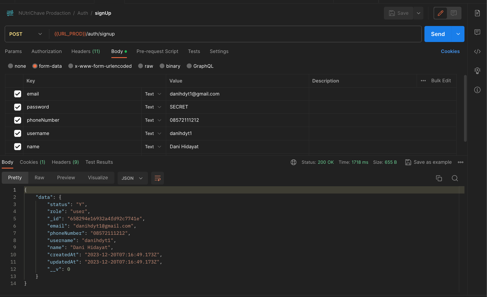
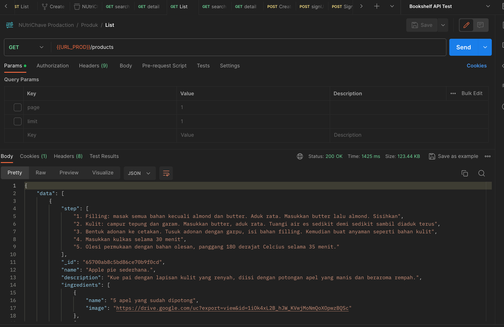
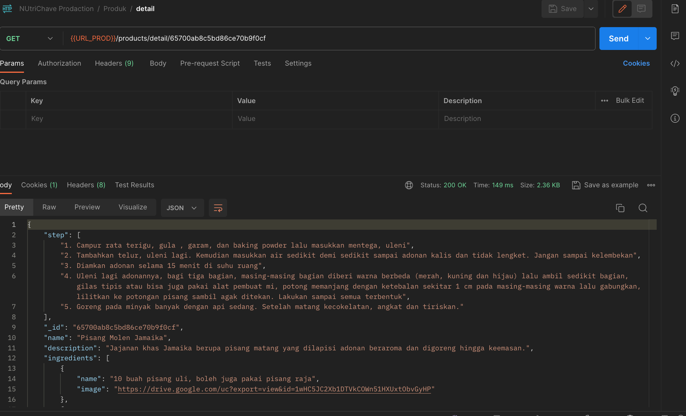
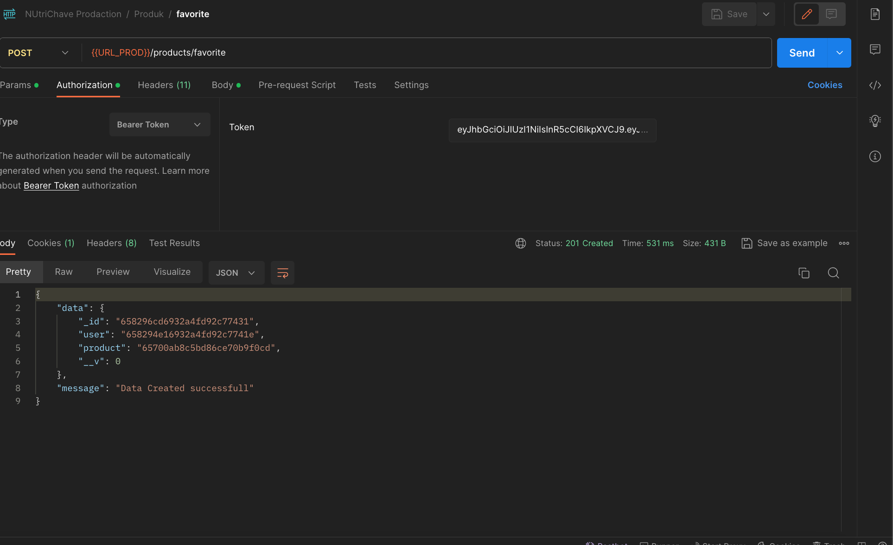
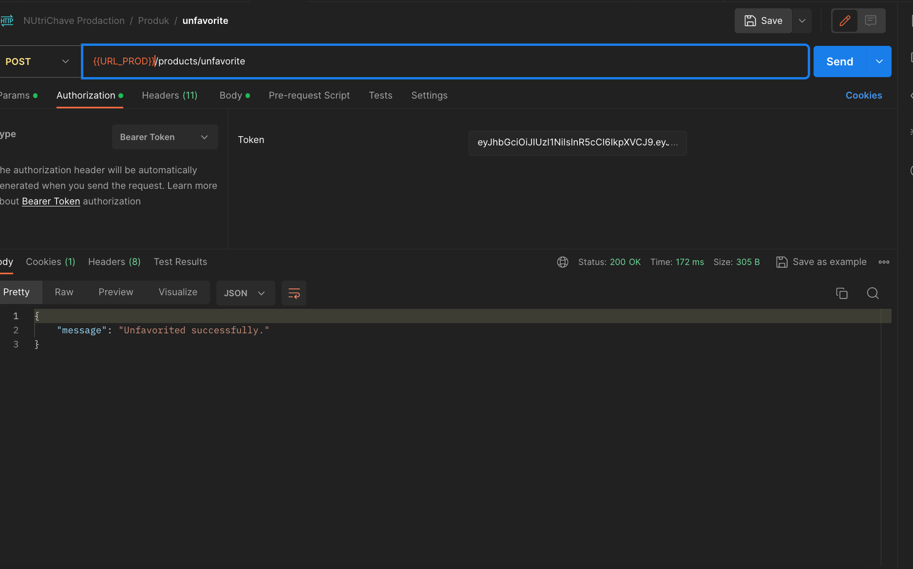
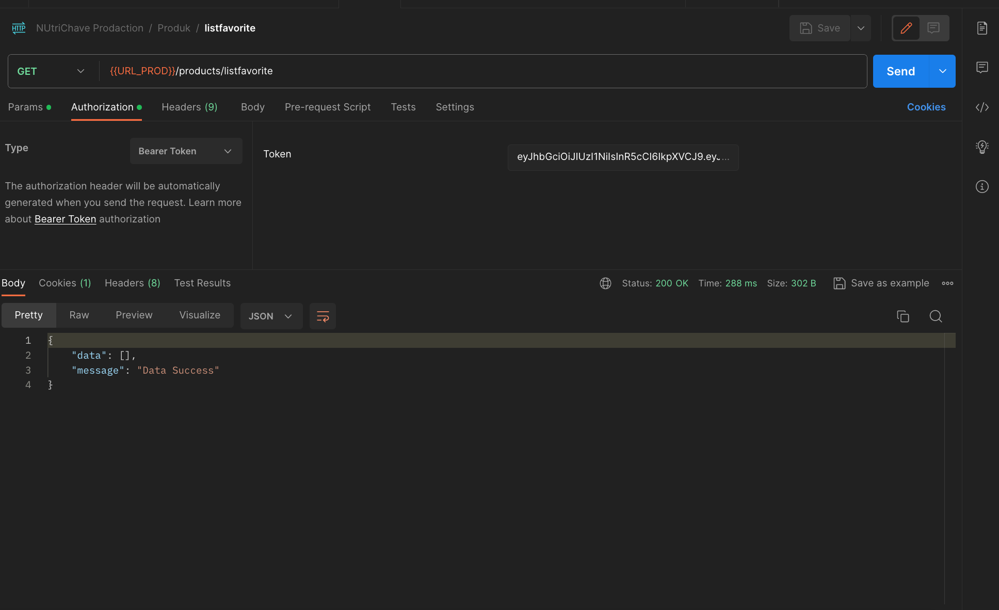
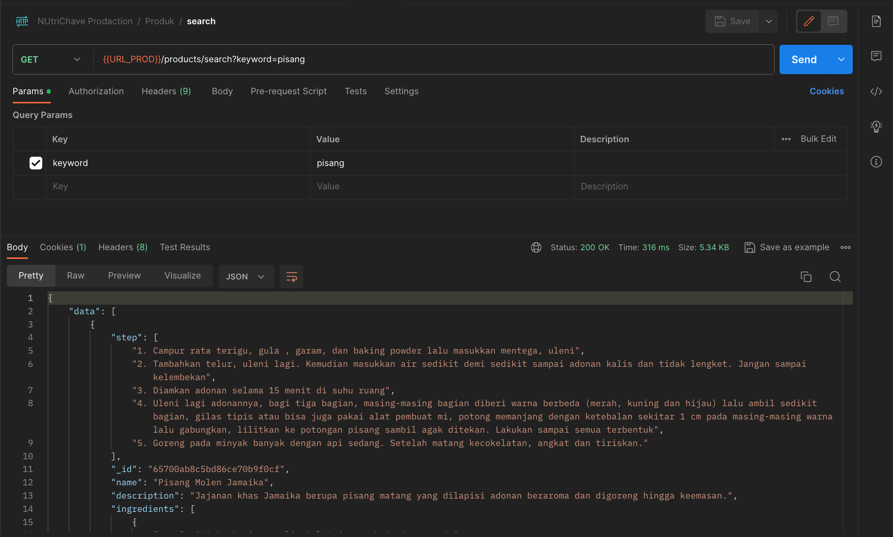

# NutriChive : Food Ingredient, Recipe, and Nutrition Archive

## Kelompok CH2-PS174

1. (ML) M312BSY0473 – Andika Kavin Septiano – Universitas Sebelas Maret - Active
2. (ML) M312BSY0914 – Muhammad Anang Fathur Rohman – Universitas Sebelas Maret - Active
3. (ML) M312BSY1043 – Mohammad Al Furqon – Universitas Sebelas Maret - Active
4. (CC) C157BSY4206 – Dani Hidayat – Universitas Mayasari Bakti - Active
5. (CC) C183BSY3336 – Iqbal Dwi Nur Khoirul Anam – Universitas Amikom Yogyakarta - Active
6. (MD) A157BSY2857 – Agung Muhammad Albaehaqi – Universitas Mayasari Bakti - Active
7. (MD) A296BSX2632 – Aisyatuz Zahroh – Universitas Pembangunan Nasional Veteran Jawa Timur - Active

# Nutrichive Backend
1. clone my project
2. npm install
3. npm run dev //for local database
4. npm run prod //for server database

# Teknologi

## Database

Proyek ini menggunakan teknologi-teknologi berikut:

### 1. Express.js
Express.js adalah framework JavaScript yang ringan dan fleksibel untuk pengembangan aplikasi web. Dengan fitur-fitur seperti routing yang mudah dan middleware yang dapat disesuaikan, Express.js menjadi pilihan populer dalam pengembangan aplikasi backend.

### 2. MongoDB
MongoDB adalah sistem basis data NoSQL yang memungkinkan penyimpanan data dalam format dokumen. Dengan kemampuan skalabilitas dan fleksibilitas skema, MongoDB menjadi pilihan yang baik untuk proyek-proyek yang membutuhkan penyimpanan data yang dinamis.

## API Endpoints
## Auth
| Method | Endpoint | Expectation | Code | Response Body | Result |
| --- | --- | --- | --- | --- | --- |
| POST | /auth/register | Able to add User data | 201 | Access Token and User data | ✅ |
| POST | /auth/login | Able to log in with Email and Password | 200 | Access Token and User data | ✅ |

## Product
| Method | Endpoint | Expectation | Code | Response Body | Result |
| --- | --- | --- | --- | --- | --- |
| GET | /products | Able to retrieve a list of product data | 200 | Array of Product data | ✅ |
| GET | /products/{id} | Able to retrieve a specific product data | 200 | Single Product data | ✅ |
| GET | /products/search?keyword={name_product} | search product data | 200 | search Product data | ✅ |
| GET | /products/listfavorite/ | Able to retrieve a list of favorite products | 200 | List of product data | ✅ |
| POST | /products/favorite | Able to add a favorite product data | 200 | Adding Favorite data | ✅ |
| POST | /products/unfavorite | Able to remove a favorite product data | 200 | Removing Favorite data | ✅ |
| GET | /products/searchFav?id_product={id_product} | Able to search for a specific favorite product data | 200 | Single product data | ✅ |

## POSTMAN DOCUMENTATION
## Login

## Register

## List Product

## Detail

## Add Favorite

## Delete Favorite

## List Favorite

## Search Favorite

## Search Product

